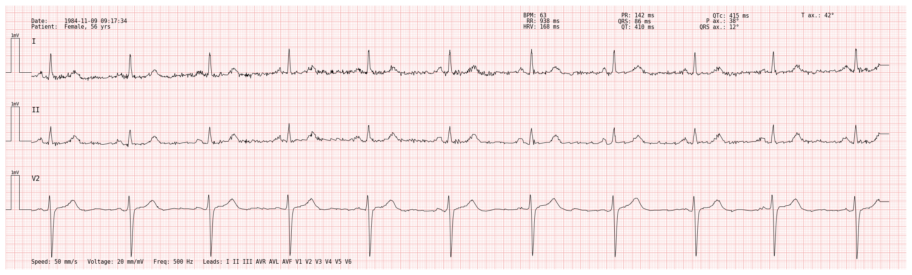
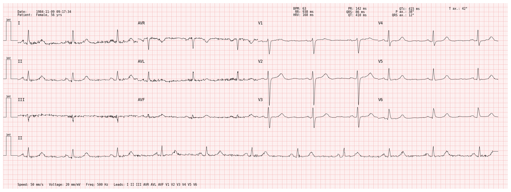

<p align="center">
  <picture>
    <source media="(prefers-color-scheme: dark)" srcset="assets/logo-dark.svg"/>
    
  </picture>
</p>

# pmecg — Plot My ECG

[](https://pypi.org/project/pmecg/)
[](https://www.gnu.org/licenses/gpl-3.0)
[](https://pypi.org/project/pmecg/)

**pmecg** is a Python library for plotting ECG (electrocardiogram) signals on a paper-like support, with flexible support for variable lead configurations, time scales, and visual styles.

## Examples

| 1×3 layout | 4×3 layout |
|:---:|:---:|
|  |  |

## Features

- **Paper-like Rendering**: Classic grid background with major/minor squares.
- **Flexible Layouts**: Plot any combination of leads using templates ('4x3', '2x6', etc.) or custom lists.
- **Diagnostic Metadata**: Print patient information (name, age, sex) and recording details directly on the plot.
- **Diagnostic Statistics**: Display ECG metrics (HR, SNR, HRV, QRS duration, etc.) directly on the plot.
- **Matplotlib-based**: Export to high-quality formats like PNG, PDF, or SVG.

## Installation

```bash
pip install pmecg
```

## Quick start

```python
import numpy as np
import pandas as pd
import pmecg

# 10-second, 12-lead ECG sampled at 500 Hz (synthetic example)
fs = 500
t = np.linspace(0, 10, int(fs * 10))
data = {name: np.random.randn(len(t)) * 0.1 for name in pmecg.SUPPORTED_LEADS}
df = pd.DataFrame(data)

# Create a plotter and render a standard 4x3 ECG plot
plotter = pmecg.ECGPlotter()
fig = plotter.plot(df, configuration="4x3", sampling_frequency=fs)
fig.savefig("ecg.png", dpi=300, bbox_inches="tight")
```

## Advanced Usage

### Patient Metadata and Statistics

You can annotate your plots with patient information and computed diagnostic stats:

```python
import pmecg

# 1. Define patient/recording information
info = pmecg.ECGInformation(
    hospital="General Hospital",
    patient_name="John Doe",
    age=45,
    sex="Male",
    date="2026-03-04",
    machine_model="ECG-Pro 3000"
)

# 2. Define statistics manually
stats = pmecg.ECGStats(bpm=72, rr_interval_ms=833, qrs_duration_ms=90)

# 3. Plot with information enabled
plotter = pmecg.ECGPlotter(print_information=True)
fig = plotter.plot(
    df, 
    configuration="4x3", 
    information=info, 
    stats=stats
)
```

### Lead Configurations

The `configuration` parameter in `ECGPlotter.plot` defines how leads are arranged on the plot:

- **`None` (default)**: Plots every lead present in the input DataFrame on its own row for its entire duration.
- **Template string**: Use a predefined layout. Supported templates include:
  - `1x1`, `1x2`, `1x3`, `1x4`, `1x6`, `1x8`, `1x12`: Single column where all leads are shown for their entire duration.
  - `2x4`, `2x6`, `4x3`: Standard multi-column layouts. `nxm` means that there are `n` rows (plus strip leads) and `m` columns (segments).
- **Custom list**: A list where each element represents a row:
  - A **single string** (e.g., `['V5']` or `['I', 'II', 'III', 'V1']`): Each lead in the list is plotted on the corresponding row for its entire length.
  - A **sub-list of strings** (e.g., `[['I', 'V1'], ['II', 'V2']]`): Leads in each sub-list are concatenated within that row. In this case, the first row would feature the first half of lead I, and the second half of lead V1. The second row would feature the first half of lead II and the second half of lead V2.
  - **sub-list of strings and strings** (e.g., `[['I', 'V1'], ['II', 'V2'], 'III']`) are used to specify what should be in each row. Sub-lists specify what lead to print on each column of that row, while strings specify the strip leads.

### Customizing the Plotter

The `ECGPlotter` class allows full control over the visual style:

```python
plotter = pmecg.ECGPlotter(
    speed=25.0,           # Paper speed in mm/s
    voltage=10.0,         # Amplitude in mm/mV
    row_distance=2.0,     # Vertical distance between zero lines of consecutive rows in mV
    line_width=0.7,       # Thickness of the signal
    grid_color="#e0e0e0", # Custom grid color
    show_time_axis=True   # Show time ticks at the bottom
)
```

## Development

```bash
git clone https://github.com/bonassifabio/pmecg.git
cd pmecg
uv sync --all-groups
uv run pytest
```

## License

Copyright (C) 2026 Fabio Bonassi

This program is free software: you can redistribute it and/or modify it under the terms of the **GNU General Public License v3** as published by the Free Software Foundation.  
See [LICENSE](LICENSE) for the full text.
